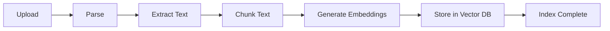
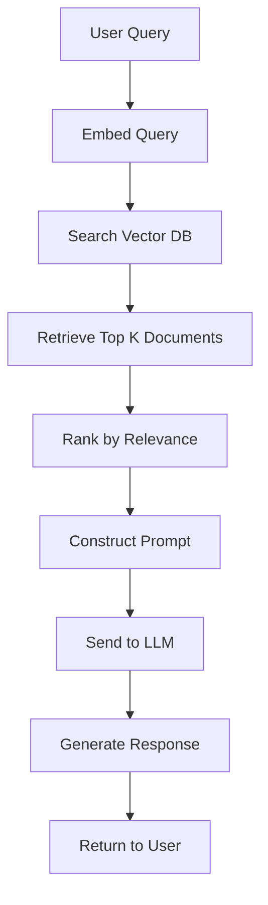

# 🚀 Getting Started Guide

Welcome to RAGFlow! This guide will help you get up and running with your first RAG (Retrieval-Augmented Generation) workflow.

## Table of Contents

- [First Login](#first-login)
- [Basic Setup](#basic-setup)
- [Creating Your First Knowledge Base](#creating-your-first-knowledge-base)
- [Uploading Documents](#uploading-documents)
- [Setting Up LLM](#setting-up-llm)
- [Your First RAG Query](#your-first-rag-query)
- [Understanding the Interface](#understanding-the-interface)
- [Next Steps](#next-steps)

## First Login

### 1. Access RAGFlow

Once your services are running, open your web browser and navigate to:
- **Web Interface**: http://localhost
- **API Endpoint**: http://localhost:9380

### 2. Initial Setup

1. **Create Account**: On first visit, you'll see a setup page
2. **Set Admin Credentials**: Choose a username and password
3. **Configure Basic Settings**: Follow the setup wizard

```bash
# Verify services are running
docker-compose ps

# Check RAGFlow logs if needed
docker-compose logs ragflow
```

### 3. Login

Use the credentials you just created to log into the RAGFlow interface.

## Basic Setup

### 1. System Settings

Navigate to **Settings** → **System**:

```yaml
# Basic system configuration
system:
  name: "My RAGFlow Instance"
  description: "Development RAG playground"
  timezone: "UTC"
  language: "en"
```

### 2. Storage Configuration

Verify storage settings in **Settings** → **Storage**:

- **Document Storage**: MinIO (configured automatically)
- **Vector Database**: Elasticsearch (configured automatically)
- **Cache**: Redis (configured automatically)

### 3. User Management

Create additional users if needed:

1. Go to **Settings** → **Users**
2. Click **Add User**
3. Fill in user details
4. Assign appropriate roles

## Creating Your First Knowledge Base

### 1. Navigate to Knowledge Bases

1. Click **Knowledge Bases** in the main menu
2. Click **Create New Knowledge Base**

### 2. Configure Knowledge Base

```yaml
# Knowledge base configuration
knowledge_base:
  name: "My First KB"
  description: "A sample knowledge base for testing"
  settings:
    chunk_size: 512
    chunk_overlap: 50
    embedding_model: "text-embedding-ada-002"
    language: "en"
```

### 3. Choose Processing Settings

| Setting | Recommended Value | Purpose |
|---------|------------------|---------|
| **Chunk Size** | 512 tokens | Balance between context and granularity |
| **Chunk Overlap** | 50 tokens | Maintain context across chunks |
| **Embedding Model** | text-embedding-ada-002 | High-quality embeddings |
| **Parser** | Auto-detect | Handles multiple file formats |

### 4. Create the Knowledge Base

Click **Create** to initialize your knowledge base.

## Uploading Documents

### 1. Supported Formats

RAGFlow supports various document formats:

- **Text**: `.txt`, `.md`, `.rtf`
- **Documents**: `.pdf`, `.docx`, `.doc`
- **Web**: `.html`, `.htm`
- **Data**: `.csv`, `.json`, `.xml`

### 2. Upload Process

1. **Select Knowledge Base**: Choose your created knowledge base
2. **Upload Files**: Drag and drop or click to select files
3. **Configure Processing**: Set document-specific options
4. **Start Processing**: Click **Process Documents**

```bash
# Example: Upload via API (optional)
curl -X POST http://localhost:9380/api/v1/documents \
  -H "Authorization: Bearer <your-token>" \
  -H "Content-Type: multipart/form-data" \
  -F "file=@document.pdf" \
  -F "knowledge_base_id=<kb-id>"
```

### 3. Monitor Processing

Watch the processing progress:

- **Status**: Shows current processing stage
- **Progress**: Percentage completed
- **Logs**: Detailed processing information

### 4. Document Processing Pipeline



## Setting Up LLM

### 1. Choose LLM Provider

RAGFlow supports multiple LLM providers:

#### OpenAI (Recommended for beginners)

1. Go to **Settings** → **LLM Providers**
2. Click **Add Provider** → **OpenAI**
3. Configure:

```yaml
openai:
  api_key: "your-openai-api-key"
  model: "gpt-3.5-turbo"
  max_tokens: 1024
  temperature: 0.1
```

#### Ollama (Local LLM)

1. Ensure Ollama service is running
2. Pull a model:

```bash
docker exec ragflow_ollama ollama pull llama2
```

3. Configure in RAGFlow:

```yaml
ollama:
  api_base: "http://ollama:11434"
  model: "llama2"
  max_tokens: 1024
  temperature: 0.1
```

#### Other Providers

- **HuggingFace**: For open-source models
- **Anthropic**: For Claude models
- **Azure OpenAI**: For enterprise deployments

### 2. Test LLM Connection

1. Go to **Settings** → **LLM Providers**
2. Click **Test Connection** next to your provider
3. Verify the test passes

## Your First RAG Query

### 1. Navigate to Chat Interface

1. Click **Chat** in the main menu
2. Select your knowledge base from the dropdown

### 2. Configure Chat Settings

```yaml
chat_settings:
  knowledge_base: "My First KB"
  llm_provider: "openai"
  model: "gpt-3.5-turbo"
  search_settings:
    top_k: 5
    similarity_threshold: 0.7
```

### 3. Ask Your First Question

Try these example queries:

```
Simple Query:
"What is the main topic of the uploaded documents?"

Specific Query:
"Can you explain the key concepts mentioned in section 2?"

Analytical Query:
"Compare the different approaches discussed in the documents."
```

### 4. Understanding the Response

RAGFlow provides:

- **Answer**: Generated response from the LLM
- **Sources**: Documents and chunks used for context
- **Confidence**: Similarity scores for retrieved content
- **Token Usage**: Tokens consumed for the query

### 5. Example RAG Flow



## Understanding the Interface

### 1. Main Dashboard

The dashboard shows:

- **Knowledge Bases**: Your document collections
- **Recent Queries**: Chat history
- **System Status**: Service health
- **Usage Statistics**: Token consumption and costs

### 2. Knowledge Base Management

- **Documents**: View and manage uploaded files
- **Chunks**: Examine text segments and embeddings
- **Analytics**: Processing statistics and performance
- **Settings**: Chunk size, overlap, and model settings

### 3. Chat Interface

- **Conversation History**: Previous queries and responses
- **Source References**: Document citations
- **Export Options**: Save conversations
- **Share Links**: Share chat sessions

### 4. Settings Panel

- **System**: Global configuration
- **Users**: User management
- **Providers**: LLM and embedding providers
- **Storage**: Database and file storage
- **Security**: Authentication and permissions

### 5. API Explorer

Access the API documentation at: http://localhost:9380/docs

Key endpoints:
- `POST /api/v1/chat/completions` - Chat with RAG
- `POST /api/v1/documents` - Upload documents
- `GET /api/v1/knowledge-bases` - List knowledge bases
- `POST /api/v1/embeddings` - Generate embeddings

## Next Steps

### 1. Advanced Features

Explore advanced RAGFlow features:

- **Multi-modal Documents**: Images, tables, and complex layouts
- **Custom Embeddings**: Fine-tuned models for your domain
- **Hybrid Search**: Combine semantic and keyword search
- **Document Hierarchies**: Organize content in collections

### 2. Integration Examples

Try integrating RAGFlow with:

```python
# Python example
import requests

def query_ragflow(question, kb_id):
    response = requests.post(
        "http://localhost:9380/api/v1/chat/completions",
        headers={"Authorization": "Bearer <token>"},
        json={
            "question": question,
            "knowledge_base_id": kb_id,
            "model": "gpt-3.5-turbo",
            "max_tokens": 1024
        }
    )
    return response.json()

# Ask a question
result = query_ragflow("What are the main findings?", "kb-123")
print(result["answer"])
```

```javascript
// JavaScript example
async function queryRAGFlow(question, kbId) {
    const response = await fetch('http://localhost:9380/api/v1/chat/completions', {
        method: 'POST',
        headers: {
            'Authorization': 'Bearer <token>',
            'Content-Type': 'application/json'
        },
        body: JSON.stringify({
            question: question,
            knowledge_base_id: kbId,
            model: 'gpt-3.5-turbo',
            max_tokens: 1024
        })
    });
    
    return await response.json();
}
```

### 3. Performance Optimization

For better performance:

1. **Optimize Chunk Size**: Test different chunk sizes for your content
2. **Fine-tune Embeddings**: Use domain-specific embedding models
3. **Implement Caching**: Cache frequent queries
4. **Monitor Costs**: Track token usage and costs

### 4. Production Deployment

When ready for production:

1. **Security**: Enable HTTPS and authentication
2. **Scaling**: Use Docker Swarm or Kubernetes
3. **Monitoring**: Set up logging and metrics
4. **Backup**: Implement regular data backups

## Troubleshooting Common Issues

### Upload Failures

```bash
# Check file size limits
docker-compose logs ragflow | grep "file size"

# Verify supported formats
curl http://localhost:9380/api/v1/supported-formats
```

### LLM Connection Issues

```bash
# Test OpenAI connection
curl -X POST http://localhost:9380/api/v1/providers/test \
  -H "Content-Type: application/json" \
  -d '{"provider": "openai", "api_key": "your-key"}'
```

### Search Not Working

```bash
# Check Elasticsearch health
curl http://localhost:1200/_cluster/health

# Verify embeddings are generated
curl http://localhost:9380/api/v1/knowledge-bases/<kb-id>/stats
```

## Learning Resources

### Documentation

- 📖 [Configuration Guide](configuration.md)
- 🔌 [API Reference](api-reference.md)
- 🤖 [LLM Integration](llm-integration.md)
- 🐛 [Troubleshooting](troubleshooting.md)

### Community

- 💬 [GitHub Discussions](https://github.com/infiniflow/ragflow/discussions)
- 📧 [Mailing List](mailto:ragflow@infiniflow.ai)
- 🔗 [Official Documentation](https://ragflow.io/docs/)

### Examples

- 🏗️ [RAG Patterns](https://github.com/ragflow-examples/patterns)
- 🔧 [Integration Examples](https://github.com/ragflow-examples/integrations)
- 📊 [Benchmarks](https://github.com/ragflow-examples/benchmarks)

Congratulations! You've successfully set up your first RAG workflow with RAGFlow. Start experimenting with different documents, queries, and models to discover the full potential of RAG technology.
